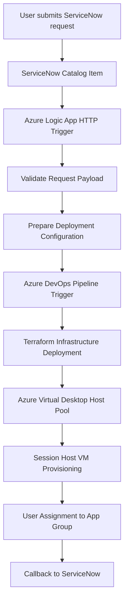
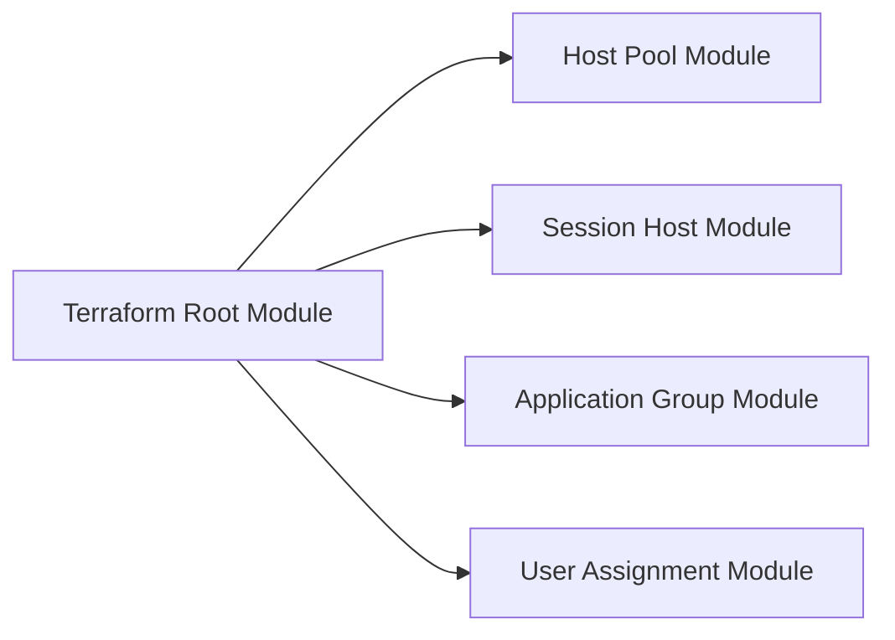
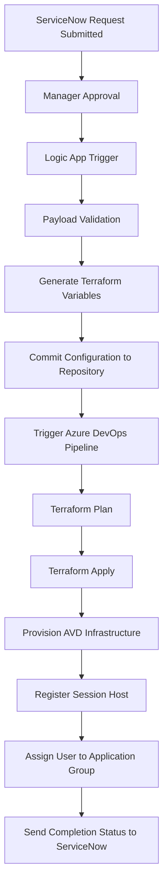
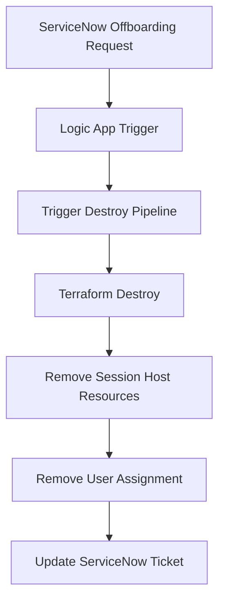

# Azure Virtual Desktop Automation


Enterprise reference architecture for automating Azure Virtual Desktop onboarding using ServiceNow, Logic Apps, Terraform and Azure DevOps.

## End-to-End Automation with ServiceNow, Logic Apps, Azure DevOps and Terraform

This repository demonstrates a **reference architecture for automating Azure Virtual Desktop (AVD) onboarding and offboarding workflows** using Infrastructure as Code and DevOps pipelines.

The solution integrates the following platforms:

- ServiceNow (request intake & approvals)
- Azure Logic Apps (automation orchestration)
- Azure DevOps (CI/CD pipeline execution)
- Terraform (Infrastructure as Code)
- Azure Virtual Desktop (desktop provisioning)

The goal is to automate the **complete lifecycle of AVD user provisioning**, from request submission to infrastructure deployment and user access assignment.

## Quick Start

1. Review the architecture diagrams in `/diagrams`
2. Read the implementation notes in `/docs`
3. Review Terraform root module in `/terraform`
4. Review reusable components in `/modules`
5. Review sample pipelines in `/pipelines`
6. Review sample Logic App workflows in `/logicapp`

## Keywords

Azure Virtual Desktop automation  
Terraform AVD deployment  
Azure DevOps pipeline automation  
ServiceNow Azure integration  
Infrastructure as Code for Azure  
Cloud automation architecture


## Status

This repository is a sanitized reference implementation for learning, documentation, and architecture discussion.

---

# Overview

In many enterprises, provisioning Azure Virtual Desktop environments is still performed manually.

Typical manual process:

1. User submits request  
2. IT team reviews request  
3. Administrator creates VM  
4. User assigned to host pool  
5. Access verified manually  

This approach introduces:

- slow provisioning
- operational overhead
- configuration errors
- lack of automation

This project demonstrates how the process can be **fully automated using DevOps practices**.

---

# High-Level Architecture



This architecture enables provisioning of AVD environments **within minutes instead of hours**.

---

# Repository Structure

```
azure-avd-automation-servicenow-terraform/

├── modules/
│   ├── avd-hostpool/
│   ├── avd-sessionhost/
│   ├── avd-appgroup/
│   └── avd-user-assignment/
│
├── terraform/
│   ├── main.tf
│   ├── variables.tf
│   ├── backend.tf
│   └── terraform.tfvars.example
│
├── pipelines/
│   ├── terraform-apply.yml
│   └── terraform-destroy.yml
│
├── logicapp/
│   ├── onboarding-workflow.json
│   └── offboarding-workflow.json
│
└── diagrams/
    ├── architecture.md
    ├── logicapp-workflow.md
    └── terraform-deployment.md
```

---

# Solution Components

## ServiceNow

ServiceNow acts as the **entry point for the automation workflow**.

Users submit requests through a catalog item containing fields such as:

- User UPN
- Department
- Host Pool Type
- Request ID

Once approved, ServiceNow sends a REST API request to the Logic App.

---

## Azure Logic Apps

Azure Logic Apps orchestrate the automation workflow.

Main responsibilities:

- Receive ServiceNow request
- Validate request payload
- Prepare Terraform configuration
- Trigger Azure DevOps pipeline
- Send completion status back to ServiceNow

---

## Azure DevOps

Azure DevOps pipelines execute Terraform deployment workflows.

Typical pipeline stages:

1. Terraform Init  
2. Terraform Plan  
3. Terraform Apply  

A separate pipeline can be used for **offboarding and infrastructure destruction**.

---

## Terraform

Terraform manages infrastructure provisioning for:

- AVD host pools
- application groups
- session host virtual machines
- user assignment

Terraform ensures infrastructure deployments are:

- repeatable
- consistent
- version controlled

---

# Terraform Module Architecture



Modules allow infrastructure components to be reused across environments.

---

# Onboarding Automation Workflow

The onboarding automation is the **core functionality of this architecture**.



### Onboarding Steps

1. User submits request through ServiceNow catalog.
2. ServiceNow approval workflow validates request.
3. ServiceNow triggers Azure Logic App via REST API.
4. Logic App validates request payload.
5. Logic App generates Terraform configuration.
6. Logic App triggers Azure DevOps pipeline.
7. Azure DevOps executes Terraform deployment.
8. Terraform provisions Azure Virtual Desktop infrastructure.
9. Session host is registered to the host pool.
10. User is assigned to the application group.
11. Status is sent back to ServiceNow.

Provisioning time typically reduces from **2 hours to 10–15 minutes**.

---

# Offboarding Automation

The architecture also supports automated offboarding.



---

# Security Considerations

When implementing this architecture in production environments, consider the following:

- Use Azure Key Vault for secrets
- Implement RBAC using Microsoft Entra ID
- Use managed identities where possible
- Store Terraform state securely
- Restrict network access using NSGs and private endpoints

---

# Monitoring

Automation systems should include monitoring and logging.

Recommended tools:

- Azure Monitor
- Log Analytics
- Azure DevOps pipeline logs

Key metrics to monitor:

- deployment success rate
- pipeline execution time
- login failures
- session host health

---

# Example Use Cases

This automation architecture can be applied in several scenarios:

- enterprise desktop provisioning
- secure remote workforce environments
- automated onboarding for large organizations
- DevOps driven infrastructure management

---

# Important Notice

This repository contains **sanitized reference implementation examples**.

The configuration is intended for **learning and demonstration purposes only**.

Do not use these examples in production environments without proper security review and customization.

---

# Future Enhancements

Potential improvements include:

- pooled host pool automation
- auto-scaling session hosts
- monitoring dashboards
- cost optimization automation
- self-service deployment portals

---

# Contributing

Contributions are welcome.

Possible improvements include:

- additional Terraform modules
- improved automation workflows
- monitoring integrations
- documentation enhancements

---
## Related Topics

Azure Virtual Desktop Terraform  
Azure DevOps Infrastructure Automation  
ServiceNow Cloud Automation  
AVD Session Host Deployment  
Terraform Azure Modules
# Author

SK Cloud Automation  
Cloud Architect | Azure | Terraform | DevOps | Automation
