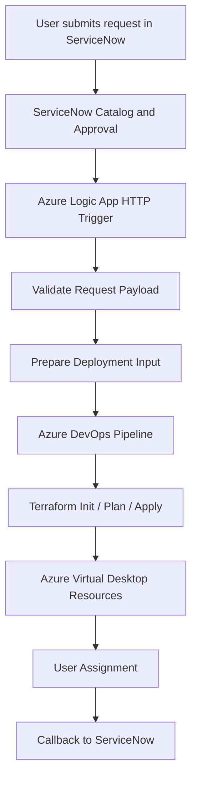

# End-to-End Architecture

This diagram shows the high-level automation flow for Azure Virtual Desktop onboarding and offboarding.

## Summary

The architecture connects IT service management with cloud infrastructure automation by using:

- ServiceNow for request intake
- Azure Logic Apps for orchestration
- Azure DevOps for execution
- Terraform for infrastructure provisioning
- Azure Virtual Desktop for desktop delivery
