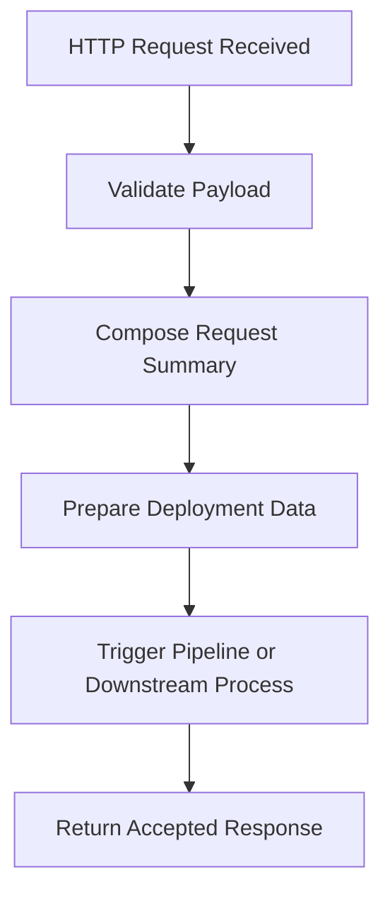

# Logic App Workflow

This diagram shows the simplified orchestration pattern used by the sample Logic App workflows.

## Summary

The Logic App acts as the orchestration layer between ServiceNow requests and deployment execution.

In a production implementation, additional steps may include:

- authentication
- branch creation
- tfvars generation
- callback handling
