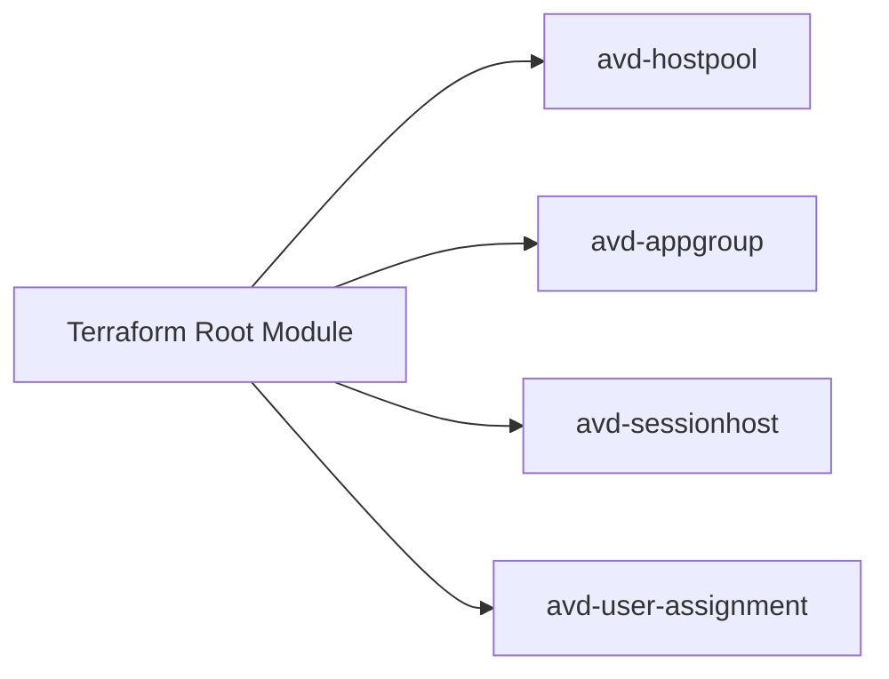
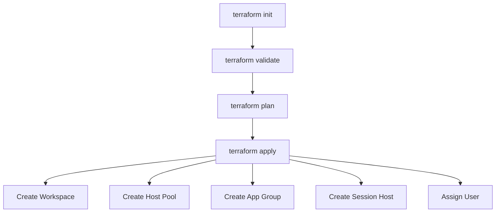

# Terraform Deployment Flow

This diagram shows how the Terraform root module composes reusable modules to provision Azure Virtual Desktop resources.

## Deployment Sequence

## Summary

The Terraform configuration is structured to keep the root module simple while delegating resource creation to reusable modules.
