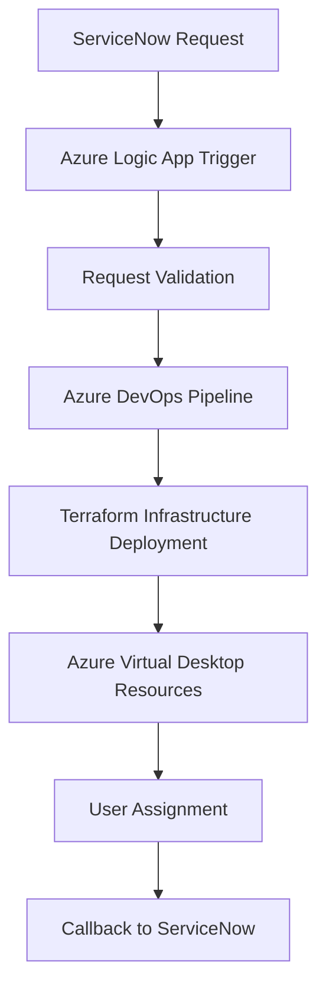
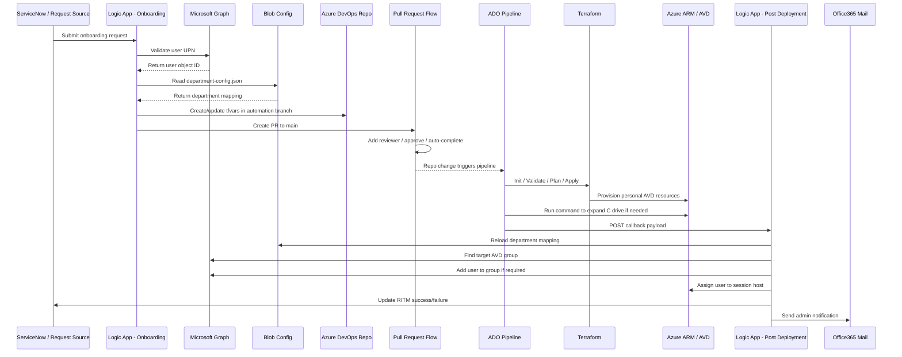

# Architecture Overview

This document describes the architecture used to automate Azure Virtual Desktop (AVD) onboarding and offboarding using ServiceNow, Azure Logic Apps, Azure DevOps pipelines, and Terraform.

The architecture demonstrates how enterprise IT service requests can trigger automated cloud infrastructure provisioning.

---

# Architecture Goals

The automation platform is designed to achieve the following objectives:

- eliminate manual provisioning of Azure Virtual Desktop environments
- reduce deployment time
- ensure infrastructure consistency
- enable infrastructure lifecycle automation
- integrate enterprise ITSM workflows with cloud provisioning

---

# High-Level Architecture

The architecture integrates multiple layers of enterprise automation.

# End-to-End AVD Automation Flow

---

# Architecture Layers

The automation platform consists of four layers.

## IT Service Management Layer

ServiceNow acts as the user interface and approval system.

Responsibilities:

- request intake
- approval workflows
- audit tracking
- lifecycle tracking

---

## Orchestration Layer

Azure Logic Apps orchestrate the automation workflow.

Responsibilities:

- receive ServiceNow request payload
- validate request parameters
- prepare infrastructure deployment inputs
- trigger Azure DevOps pipelines
- return deployment status

---

## DevOps Execution Layer

Azure DevOps pipelines act as the execution engine.

Responsibilities:

- run Terraform commands
- manage deployment workflows
- maintain infrastructure state
- provide deployment logs

Typical pipeline stages:

- Terraform Init
- Terraform Plan
- Terraform Apply

---

## Infrastructure Layer

Terraform provisions Azure resources required for Azure Virtual Desktop.

Resources deployed may include:

- AVD host pools
- application groups
- session host virtual machines
- workspace configuration
- user assignments

Terraform ensures infrastructure deployments are:

- repeatable
- version controlled
- consistent across environments

---

# Azure Virtual Desktop Components

The automation provisions the following AVD components.

## Host Pool

A host pool defines a collection of session host virtual machines.

Key attributes:

- personal or pooled host pool
- load balancing configuration
- maximum sessions

---

## Session Host

Session hosts are the virtual machines that deliver desktops to users.

Automation tasks include:

- virtual machine provisioning
- host pool registration
- domain join
- monitoring configuration

---

## Application Group

Application groups define which desktops or applications users can access.

Types:

- desktop application group
- remote application group

---

## Workspace

Workspaces provide a logical container for application groups.

Users access Azure Virtual Desktop resources through workspace assignments.

---

# Request Flow

The end-to-end request flow is described below.

1. User submits ServiceNow catalog request.
2. Request approval workflow is executed.
3. ServiceNow triggers Azure Logic App.
4. Logic App validates the request payload.
5. Logic App triggers Azure DevOps pipeline.
6. Azure DevOps executes Terraform deployment.
7. Terraform provisions Azure Virtual Desktop resources.
8. User is assigned to the application group.
9. Logic App sends completion status back to ServiceNow.

---

# Key Benefits

This automation architecture provides the following benefits:

- faster provisioning of Azure Virtual Desktop environments
- reduction in manual configuration errors
- improved infrastructure governance
- consistent infrastructure deployment
- integration between ITSM and cloud automation

---

# Architecture Considerations

When implementing this architecture in production environments, consider:

- secure storage of secrets using Azure Key Vault
- RBAC enforcement using Microsoft Entra ID
- network isolation using private endpoints
- monitoring using Azure Monitor
- centralized logging using Log Analytics

---

# Summary

This architecture demonstrates how enterprise organizations can automate the lifecycle of Azure Virtual Desktop infrastructure by integrating ITSM workflows with Infrastructure as Code and DevOps automation.
