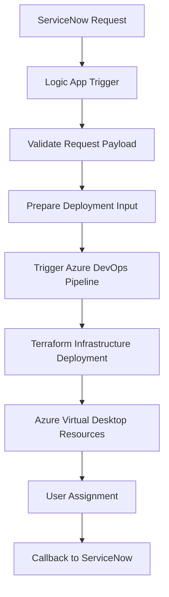
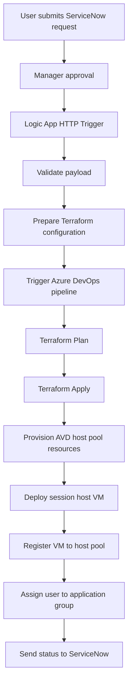

# Automation Workflow

This document explains the end-to-end automation workflow for Azure Virtual Desktop provisioning and deprovisioning.

The automation platform integrates ServiceNow, Azure Logic Apps, Azure DevOps pipelines, and Terraform.

Two primary workflows are supported:

- User Onboarding
- User Offboarding

---

# End-to-End Workflow

The overall workflow follows this architecture.

---

# Onboarding Workflow

The onboarding workflow provisions Azure Virtual Desktop infrastructure and assigns the user to the environment.

---

# Onboarding Workflow Steps

### 1 Service Request

A user submits a request through the ServiceNow service catalog.

Typical request parameters include:

- user UPN
- department
- host pool type
- request ID

---

### 2 Approval Workflow

ServiceNow executes approval workflows to validate the request.

Approvals may include:

- manager approval
- IT approval
- security approval

---

### 3 Logic App Trigger

Once approved, ServiceNow sends an HTTP request to Azure Logic Apps.

The request payload contains the provisioning details required for deployment.

---

### 4 Payload Validation

Logic App validates:

- required parameters
- request format
- allowed host pool types

If validation fails, the request is rejected
